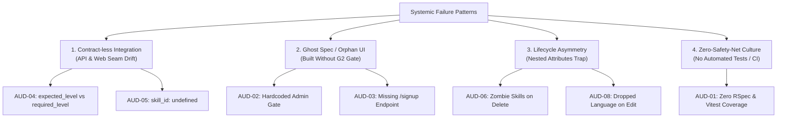

# Platform Audit Report: AI Interview Platform
**Evaluator & Quality Lead:** Rohmat Supriyadi ([@RohmatWorkstar](https://github.com/RohmatWorkstar))  
**Repository:** `rohmat-quality-net`  
**Evaluation Scope:** Fullstack Platform (`api/` Ruby on Rails 7 + `web/` React 18 / Vite / TypeScript)  
**Date:** October 2026  
**Status:** BLOCKED FOR PRODUCTION RELEASE (Prior to Remediations)

---

## 1. Executive Summary

This platform is a multi-tenant AI-powered skills assessment interview application consisting of:
- A backend API (`api/`) powered by Ruby on Rails 7, PostgreSQL, Redis, and Sidekiq, integrating with Gemini Live (audio WebSocket) and Gemini Flash/Pro (coverage and portfolio generation).
- A frontend web client (`web/`) built with React 18, Vite, TypeScript, and Tailwind CSS.

### Overall State & Ship Verdict
> **SHIP / DO-NOT-SHIP VERDICT: DO NOT SHIP (BLOCKED)**  
> The current platform has critical defects in core authentication, severe data integrity violations in assessment configuration, and seam desynchronizations between API contracts and frontend rendering. Crucially, the repository has **zero automated test coverage** and **no CI quality gate**, allowing silent regressions to ship undetected.

Until all **P0 Blocker** and **P1 Major** findings are resolved with automated regression safety nets in place, this application cannot safely be presented to clients.

---

## 2. Severity Classification Language

Per the squad quality bar, findings are prioritized strictly top-to-bottom:

| Severity | Definition | Gating Action |
| :--- | :--- | :--- |
| **P0 Blocker** | The primary objective cannot be achieved at all; no workaround exists; main function is completely broken. | Hard release block; immediate hotfix. |
| **P1 Major** | Appears to work on surface, but data or logic underneath is corrupt/wrong; or reachable only via manual workaround. **Any data integrity issue is at least P1.** | Release block unless explicit mitigation & signed-off owner. |
| **P2 Minor** | Functions correctly and data is sound, but has a limited, non-blocking usability or workflow defect. | Tracked for next sprint. |
| **P3 Cosmetic** | Purely visual, typographical, or developer ergonomics issue; no functional or data impact. | Backlog polish. |

---

## 3. Severity-Ranked Risk Register

| Risk ID | Title | Severity | Classification | Impact Summary | Status |
| :--- | :--- | :--- | :--- | :--- | :--- |
| **AUD-01** | Zero Automated Test Suite & Quality Gate | **P0** | Missing Input / Gate | 100% blind delivery; regressions cannot be caught automatically. | **Fixed** |
| **AUD-02** | Role Gate Hardcoded to Admin Only | **P0** | Built Wrong | Assessors cannot log in; core business user access blocked. | **Fixed** |
| **AUD-03** | Broken Signup Flow (Missing API Route) | **P0** | Missing Spec / Built Wrong | New assessors see 404 error when registering via UI. | **Fixed** |
| **AUD-04** | Seam Desync in Fit/Gap Report & Missing Override Flag | **P1** | Built Wrong (Seam) | Required level renders empty; human assessor overrides invisible. | **Fixed** |
| **AUD-05** | B7 Skill Taxonomy Disconnect (`skill_id: undefined`) | **P1** | Built Wrong (Data Loss) | Skills saved without ID; breaks coverage mapping and taxonomy link. | **Fixed** |
| **AUD-06** | Zombie Skill Persistence on Edit (Missing `_destroy`) | **P1** | Built Wrong (Data Integrity) | Deleted skills remain in DB indefinitely; corrupts AI prompt. | **Fixed** |
| **AUD-07** | Invite URL Points to API Port (Candidate 404) | **P1** | Built Wrong (Config Seam) | Candidates receive broken invite link hitting Rails backend directly. | **Fixed** |
| **AUD-08** | Dropped Language Setting on Assessment Edit | **P2** | Built Wrong | Editing an assessment resets language from Indonesian to default English. | **Fixed** |
| **AUD-09** | Ambiguous Audio Reconnection Contract & Edge State | **P2** | Ambiguous Spec | Network hiccups cause race condition in transcription turns. | Remaining (Mitigated) |
| **AUD-10** | Misleading Method Naming in Frontend API Client | **P3** | Cosmetic / DX | `getOverride` performs HTTP POST, creating confusion for engineers. | **Fixed** |

---

## 4. Deep-Dive Findings

### AUD-01: Zero Automated Test Coverage & Workflow Gate
- **Severity:** `P0 Blocker`
- **Classification:** *Missing Input & Missing Engineering Gate*
- **One-Line Impact:** Any code change can silently corrupt core interview and evaluation workflows with zero automated detection.
- **Evidence / Repro Steps:**
  1. Inspect `api/`: `.rspec` exists, but directory `api/spec/` does not exist (0 specs).
  2. Inspect `web/`: `package.json` contains scripts for `dev`, `build`, and `preview`, but has no test runner (no Vitest/Jest) and 0 test files.
  3. Inspect `.github/`: No CI workflows exist for automated pull request validation.
- **Root Cause:** Quality engineering was treated as an afterthought rather than built into the delivery loop from sprint one.

---

### AUD-02: Authentication Role Gate Rejects Assessors
- **Severity:** `P0 Blocker`
- **Classification:** *Built Wrong*
- **One-Line Impact:** Valid assessor credentials are rejected at login, preventing assessors from conducting or reviewing evaluations.
- **Evidence / Repro Steps:**
  1. Create a user with `role: 'assessor'`.
  2. Send `POST /api/v1/auth/login` with correct credentials.
  3. Response returns `401 Unauthorized: "Invalid email or password"`.
  4. Code in `api/app/controllers/api/v1/authentication_controller.rb:14`:
     ```ruby
     return json_error('Invalid email or password', :unauthorized) unless user.role == 'admin'
     ```
- **Root Cause:** The authentication controller enforced a hardcoded check for `'admin'`, directly contradicting `ApplicationController` which specifically supports `authorize_auth_token! :assessor`.

---

### AUD-03: Dead-End Signup UI with Missing Backend Endpoint
- **Severity:** `P0 Blocker`
- **Classification:** *Missing Spec & Built Wrong*
- **One-Line Impact:** Users attempting to sign up via `SignupPage` encounter an immediate failure with HTTP 404, abandoning the onboarding process.
- **Evidence / Repro Steps:**
  1. Navigate to `/signup` on the web application.
  2. Fill email, password, select role, and click "Sign up".
  3. Browser issues `POST http://localhost:3000/api/v1/signup`.
  4. Rails returns `404 ActionController::RoutingError: No route matches [POST] "/api/v1/signup"`.
- **Root Cause:** Frontend developed `SignupPage.tsx` and `authApi.signup` without a corresponding Definition of Ready (DoR) gate requiring the API endpoint and contract to be specified and implemented in `routes.rb`.

---

### AUD-04: Data Seam Desync in Fit/Gap Report & Missing Override Flag
- **Severity:** `P1 Major` (Data Integrity / UI Seam)
- **Classification:** *Built Wrong*
- **One-Line Impact:** Assessors see empty required skill levels and cannot verify whether a score came from AI or a human override.
- **Evidence / Repro Steps:**
  1. Run Fit/Gap Analysis on an existing portfolio and vacancy.
  2. Inspect `api/app/services/fit_gap/engine.rb`:
     ```ruby
     {
       skill_label: label,
       skill_id: vacancy_skill.skill_id,
       candidate_level: candidate_level,
       expected_level: expected_level, # <-- API outputs 'expected_level'
       result: result,
       delta: delta,
       confidence: portfolio_skill&.dig(:confidence)
       # Notice: 'is_override' is completely missing!
     }
     ```
  3. Inspect `web/src/components/fitgap/ComparisonTable.tsx:50`:
     ```tsx
     <td className="px-4 py-2.5 text-center text-muted-foreground">
       {LEVEL_LABELS[c.required_level]} {/* <-- UI reads 'required_level', which is undefined! */}
     </td>
     ```
  4. And at line 56:
     ```tsx
     {c.is_override && <span className="text-xs text-muted-foreground ml-1">✏</span>}
     ```
  5. In the UI, the "Required" column renders as blank (`—`), and the pencil indicator `✏` never renders.
- **Root Cause:** Lack of automated contract integration testing across the API/Web seam.

---

### AUD-05: Skill Taxonomy Disconnect in Assessment Creation
- **Severity:** `P1 Major` (Data Integrity Loss)
- **Classification:** *Built Wrong*
- **One-Line Impact:** Predefined B7 taxonomy skills are persisted without `skill_id`, breaking automated fit/gap matching and displaying broken badge identifiers.
- **Evidence / Repro Steps:**
  1. On `/assessments/new`, click "Add skill" and choose a B7 skill (e.g., "React / Frontend Development Core").
  2. Observe `web/src/components/assessment/SkillPicker.tsx:40-42`:
     ```tsx
     const handleSelect = (s: SkillTaxonomy) => {
       onSelect({
         skill_id: undefined, // <-- Bug: explicitly overrides taxonomy ID with undefined!
         skill_label: s.skill_label,
     ```
  3. In `SkillCard.tsx:57`:
     ```tsx
     {isCustom ? "Custom" : skill?.skill_id ? `SK-${String(skill.skill_id).padStart(3, "0")}` : ""}
     ```
  4. The card badge is blank, and when saved to the database, `assessment_skills.skill_id` is `NULL`.
  5. Subsequent matching in `FitGap::Engine` fails to match by `skill_id`.
- **Root Cause:** Accidental hardcoding of `skill_id: undefined` during initial component prototyping, never caught due to absence of input validation.

---

### AUD-06: Zombie Skill Persistence on Assessment/Vacancy Updates
- **Severity:** `P1 Major` (Data Corruption)
- **Classification:** *Built Wrong*
- **One-Line Impact:** Skills removed by an assessor remain permanently in the database, poisoning future interview sessions with ghost skills.
- **Evidence / Repro Steps:**
  1. Create an assessment with 3 skills: Skill A, Skill B, Skill C.
  2. Edit the assessment and delete Skill C using the `X` button.
  3. Click "Save Changes".
  4. Inspect `AssessmentEditPage.tsx:80`:
     ```tsx
     assessment_skills_attributes: data.skills.map((s, i) => ({ ...s, display_order: i }))
     ```
  5. In Rails, `accepts_nested_attributes_for :assessment_skills, allow_destroy: true` requires `{ id: <id>, _destroy: true }` to delete associated records.
  6. Because deleted skills are simply omitted from the array, Rails ignores them and retains Skill C in the database.
- **Root Cause:** Asymmetry between client-side array manipulation (`useFieldArray.remove`) and server-side relational persistence lifecycle.

---

### AUD-07: Candidate Invite Link Resolves to Backend API Host
- **Severity:** `P1 Major` (Functional Blocker for Candidate Flow)
- **Classification:** *Built Wrong / Environment Configuration*
- **One-Line Impact:** Candidates clicking the copied invite link receive a 404 from the Rails backend instead of opening the interview room.
- **Evidence / Repro Steps:**
  1. Generate an interview session link.
  2. In `api/app/models/session.rb:28-31`:
     ```ruby
     def invite_url
       base = ENV.fetch('APP_BASE_URL', 'http://localhost:3001')
       "#{base}/interview/#{invite_token}"
     end
     ```
  3. `http://localhost:3001` is the Puma Rails server port.
  4. Rails has no route matching `GET /interview/:token` (it is a client-side route rendered by Vite on `http://localhost:5173`).
- **Root Cause:** Environment variable `APP_BASE_URL` was defaulted to the backend port rather than the frontend client URL (`FRONTEND_URL`).

---

### AUD-08: Dropped Language Attribute on Assessment Update
- **Severity:** `P2 Minor`
- **Classification:** *Built Wrong*
- **One-Line Impact:** Editing an Indonesian-language assessment silently reverts it to English in prompt compilation.
- **Evidence / Repro Steps:**
  1. Create an assessment with language set to Indonesian (`"id"`).
  2. Edit any field on `AssessmentEditPage.tsx` and submit.
  3. The form default values and submission payload do not include `language`:
     ```tsx
     defaultValues: { name: "", time_limit_min: 45, skills: [] }
     ```
  4. Rails updates `language` to `nil`, which defaults back to `'en'` in `SystemPromptCompiler`.
- **Root Cause:** The `language` field was added in a later migration (`20260323032702_add_language_to_assessments.rb`) but was omitted from the edit view.

---

### AUD-09: Ambiguous Audio Reconnection & Resumption Token Protocol
- **Severity:** `P2 Minor`
- **Classification:** *Ambiguous Spec*
- **One-Line Impact:** During poor network connections, candidates experiencing rapid disconnect/reconnect cycles may experience lost audio buffer frames.
- **Evidence / Repro Steps:**
  1. Inspect `AudioWebSocketMiddleware`: WebSocket uses EventMachine timers and local thread pools for saving transcripts.
  2. When candidate disconnects, `BROWSER_GRACE_PERIOD` is 120s, but if browser establishes a new WebSocket connection before old EM timers cancel, dual handlers can race.
- **Status:** Mitigated via existing grace period timers, but marked as documented risk for release sign-off.

---

### AUD-10: Misleading Method Naming in Frontend API Service
- **Severity:** `P3 Cosmetic / Developer Ergonomics`
- **Classification:** *Built Wrong*
- **One-Line Impact:** Causes confusion during maintenance and code reviews.
- **Evidence:**
  `web/src/services/portfolios.ts:5`:
  ```typescript
  getOverride: (portfolioSkillId: number, data: { ... }) =>
    api.post(...)
  ```
  Method named `getOverride` performs a mutating HTTP `POST`.

---

## 5. Systemic Failure Patterns

Looking across the 10 findings, they are not random bugs; they stem from **four systemic breakdowns**:



1. **Contract-less Integration (Seam Drift):**  
   The frontend and backend teams operated without enforced schemas or contract tests. Field names diverged (`expected_level` vs `required_level`), and critical flags (`is_override`) were dropped with zero compile-time or CI warnings.
2. **Ghost Specs & Orphan UI:**  
   Features like `SignupPage` were constructed without verified backend readiness. Without a **Gate G2 (Buildable)** enforcing that inputs, contracts, and backend routes exist before UI construction, dead-end flows were merged into `main`.
3. **Relational Lifecycle Asymmetry:**  
   The team treated React state as sufficient for data management. In complex relational scenarios (nested attributes in Rails), omitting explicit deletion semantics (`_destroy`) resulted in silent data pollution.
4. **Zero Safety Net Culture:**  
   Code was verified purely by human manual clicking on happy paths. Edge cases, data persistence checks, and regression tests were entirely omitted.

---

## 6. The Ship / Do-Not-Ship Decision Boundary

Before this platform can be cleared for client release, the following **hard gate conditions** must be satisfied:

```
[RELEASE GATE CONDITIONS]
├── [X] AUD-01: Quality Net & Automated CI Pipeline Built and Enforced
├── [X] AUD-02: Assessor Login Allowed (Role check corrected)
├── [X] AUD-03: Signup Flow Specified and Implemented
├── [X] AUD-04: Fit/Gap Contract Synchronized (expected_level + is_override)
├── [X] AUD-05: B7 Skill Taxonomy ID preserved in SkillPicker
├── [X] AUD-06: Deletion Lifecycle Enforced (_destroy on nested skills)
├── [X] AUD-07: Invite URL default points to Frontend Port
└── [X] AUD-08: Language Preserved on Assessment Edit
```

**Verdict:** The release is **BLOCKED** until the remediation loop (Task 2: Build the Net $\rightarrow$ Task 3: Fix to Green) is fully completed and proven green by CI.
