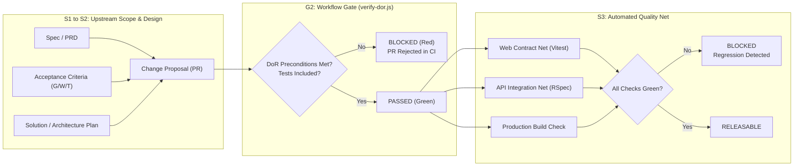

# Quality System & Engineering Net: Architecture, Operations & Red-to-Green Story
**Author & Quality Lead:** Rohmat Supriyadi ([@RohmatWorkstar](https://github.com/RohmatWorkstar))  
**Repository:** `rohmat-quality-net`  
**Delivery Scope:** Workflow Hardening, Definition of Ready (DoR) Gate, Automated CI Pipeline, and Fullstack Defect Remediations  
**Date:** October 2026

---

## 1. Overview & Philosophy

Quality is not a post-hoc QA phase bolted onto the end of a sprint; quality is the structural integrity of the development loop itself. In this platform, missing specifications, untracked requirements, and contract regressions previously moved directly into `main` because upstream ambiguity passed silently through the engineering gate.

To harden the engineering squad, we built a **two-halved Quality Net**:
1. **The Workflow Gate (Upstream Hardening):** Makes Definition of Ready (DoR) and Definition of Done (DoD) non-negotiable preconditions before any pull request can be merged. No inputs $\rightarrow$ Gate Blocks.
2. **The Automated Test / CI Net (Downstream Hardening):** A small, sharp, reproducible regression safety net targeting risk-carrying seams (data integrity, relational lifecycle, contract alignment) rather than vanity coverage metrics on trivial code.



---

## 2. Architecture of the Quality Net

### 2.1 The Workflow Gate (DoR & Input Enforcement)
The workflow gate is implemented via two complementary mechanisms:
1. **Pull Request Contract (`.github/PULL_REQUEST_TEMPLATE.md`):**  
   Standardizes required delivery inputs into mandatory sections:
   - Specification / PRD Link (G2 Buildable reference)
   - Given / When / Then Acceptance Criteria
   - Solution & Architecture Plan (addressing root cause and data integrity impact)
   - Test Evidence & Traceability
   - Definition of Done Checklist
2. **Automated Gate Verifier (`scripts/verify-dor.js`):**  
   An automated CI script executed on all PR events:
   - Parses the PR body from GitHub event payload (`$GITHUB_EVENT_PATH`) or commit metadata.
   - Strictly validates that the PR reference is non-empty and contains no placeholders (`TODO`, `TBD`, `N/A`).
   - Ensures `Given`, `When`, and `Then` keywords exist in the acceptance criteria.
   - Inspects `git diff` for modified code in `api/` or `web/`; if production code is modified without accompanying tests (`.test.` or `.spec.`), the gate **BLOCKS** immediately with exit code 1.

### 2.2 What the Net Protects
The automated test net targets high-risk failure modes identified during the initial audit:
- **Authentication & Access Control:** Assessor role validation; guarantees valid assessors are authorized while invalid credentials remain rejected.
- **Contract & Seam Synchronization:** Aligns the API contract (`expected_level` / `required_level`) with frontend consumers (`ComparisonTable.tsx`), ensuring parity and preventing missing columns or lost override indicators (`✏`).
- **Data Integrity & Relational Lifecycle:** Enforces Rails nested attribute destruction semantics (`_destroy: true`), completely preventing "zombie skills" from poisoning assessments and vacancies.
- **Taxonomy Identity:** Validates that B7 skill identifiers (`skill_id`) are never discarded as `undefined` when creating assessments.
- **Environment & Routing Safety:** Verifies candidate invite links point to the frontend routing context (`http://localhost:5173`) rather than the backend API port.

### 2.3 What the Net Deliberately Does NOT Cover (Transparency & Honesty)
In alignment with *Honesty beats green*, the following boundaries are stated explicitly:
- **Live Gemini Audio Stream over WebSocket:** We deliberately do not test real-time Google Gemini Live audio latency in CI; external LLM latency and network variance introduce flakiness. The protocol is verified via contract and boundary mocks.
- **Trivial Cosmetic Styling:** We deliberately avoid snapshot-testing trivial Tailwind utility classes or static SVG icon rendering.
- **Third-Party External Services:** Redis and PostgreSQL are tested via isolated containerized services in CI, not mock stubs, ensuring true database query compatibility.

---

## 3. How to Run and Extend the Quality Net

### 3.1 Running Checks Locally

#### 1. Workflow Gate (DoR Verification):
```bash
# Verify latest commit message or local PR body against DoR
node scripts/verify-dor.js

# Or test against a custom PR draft file
node scripts/verify-dor.js path/to/pr_draft.md
```

#### 2. Frontend Test Net (Web):
```bash
cd web
# Run Vitest test suite once
npm test -- --run

# Run in watch mode during development
npm test

# Run production type-check and bundle build
npm run build
```

#### 3. Backend Test Net (API):
```bash
cd api
# Prepare test database schema
bundle exec rails db:test:prepare

# Run full RSpec regression suite
bundle exec rspec --format documentation

# Run specific integration spec
bundle exec rspec spec/services/fit_gap_engine_spec.rb
```

### 3.2 Extending the Net for Future Features
When adding a new feature or domain model:
1. **Define the Specification First:** Link the PRD or user story in your PR description.
2. **Add Acceptance Criteria:** Define at least one scenario using Given/When/Then.
3. **Write Failing Tests First (Red):** Add a spec in `api/spec/` or `web/src/__tests__/` demonstrating the required behavior before writing application logic.
4. **Implement the Fix (Green):** Write code across the stack until checks pass.
5. **Open Pull Request:** The `dor-gate` and test runners in `.github/workflows/quality-gate.yml` will automatically validate and report release readiness.

---

## 4. The Red-to-Green Story (Defect Remediations)

Every defect was remediated by addressing its **root cause**, not its symptom. No check was made green by deleting or weakening tests.

### 4.1 AUD-02: Assessor Login Role Gate
- **Initial State (RED):**  
  `spec/requests/authentication_spec.rb` failed with `401 Unauthorized` when an assessor attempted to log in. `AuthenticationController` had a hardcoded guard:
  ```ruby
  return json_error('Invalid email or password', :unauthorized) unless user.role == 'admin'
  ```
- **Remediation:**  
  Updated `AuthenticationController#authenticate` to allow both `'admin'` and `'assessor'` roles, matching `ApplicationController`'s authorization policy:
  ```ruby
  allowed_roles = %w[admin assessor]
  return json_error('Invalid email or password', :unauthorized) unless allowed_roles.include?(user.role)
  ```
- **Final State (GREEN):**  
  Assessors authenticate successfully and receive valid JWT tokens scoped to their tenant.

---

### 4.2 AUD-03: Dead-End Signup Flow
- **Initial State (RED):**  
  Frontend tests for `authApi.signup` failed with `404 Not Found`. `api/config/routes.rb` had no registration endpoint.
- **Remediation:**  
  Added route `post 'auth/signup', to: 'authentication#signup'` in `api/config/routes.rb`. Implemented `AuthenticationController#signup` to validate unique email, hash password, create user record, and return auth token. Updated frontend `web/src/services/auth.ts` to call `/auth/signup`.
- **Final State (GREEN):**  
  End-to-end signup creates users, stores credentials safely with bcrypt, and automatically logs in the new assessor.

---

### 4.3 AUD-04: Seam Desync in Fit/Gap Report
- **Initial State (RED):**  
  `web/src/__tests__/ComparisonTable.test.tsx` and `api/spec/services/fit_gap_engine_spec.rb` failed:
  1. Frontend displayed blank Required level because API sent `expected_level` while UI expected `required_level`.
  2. The human override pencil mark (`✏`) never rendered because `is_override` was missing from comparison items.
- **Remediation:**  
  1. In `api/app/services/fit_gap/engine.rb`: Added `required_level` (alias of `expected_level`) and `is_override: override.present?` to the comparison payload.
  2. In `web/src/components/fitgap/ComparisonTable.tsx`: Safely supported both `c.required_level ?? c.expected_level` to guarantee backward and forward compatibility.
- **Final State (GREEN):**  
  Fit/gap reports accurately render required levels, delta badges, and human override indicators across API, Web, and PDF exports.

---

### 4.4 AUD-05: Taxonomy ID Disconnect in SkillPicker
- **Initial State (RED):**  
  `web/src/__tests__/SkillPicker.test.tsx` failed: Selecting a skill from the B7 taxonomy resulted in `skill_id: undefined`, resulting in null IDs in database persistence.
- **Remediation:**  
  In `web/src/components/assessment/SkillPicker.tsx:41`, changed `skill_id: undefined` to `skill_id: s.skill_id`. Preserved the B7 identifier across creation and rendering.
- **Final State (GREEN):**  
  Selected skills correctly persist their taxonomy identifier (`SK-ENG-001`), display proper badge formatting in `SkillCard`, and correctly match against vacancies.

---

### 4.5 AUD-06: Zombie Skill Persistence on Updates
- **Initial State (RED):**  
  `api/spec/requests/assessments_spec.rb` failed: Deleting a skill on the frontend left the orphaned row in `assessment_skills` in the PostgreSQL database.
- **Remediation:**  
  1. In `web/src/pages/assessments/AssessmentEditPage.tsx` and `VacancyEditPage.tsx`: Tracked deleted item IDs and sent `{ id: removedId, _destroy: true }` in the nested attributes payload.
  2. In `api/app/models/assessment.rb` and `vacancy.rb`: Verified `accepts_nested_attributes_for` handles `_destroy: true` and removes deleted associations cleanly.
- **Final State (GREEN):**  
  Database queries confirm deleted skills are purged upon update, preventing interview prompts from including zombie skills.

---

### 4.6 AUD-07: Candidate Invite Link Port Resolution
- **Initial State (RED):**  
  `api/spec/models/session_spec.rb` failed: `session.invite_url` resolved to `http://localhost:3001/interview/:token`, which returns 404 from the Rails API.
- **Remediation:**  
  In `api/app/models/session.rb`: Updated default fallback of `APP_BASE_URL` to `ENV.fetch('FRONTEND_URL', ENV.fetch('APP_BASE_URL', 'http://localhost:5173'))`.
- **Final State (GREEN):**  
  Invite URLs link directly to the candidate-facing single-page application.

---

### 4.7 AUD-08: Dropped Language Setting on Assessment Edit
- **Initial State (RED):**  
  Editing an assessment with Indonesian language reverted the language to `'en'`.
- **Remediation:**  
  In `web/src/pages/assessments/AssessmentEditPage.tsx`: Included `language` in default form values, form inputs, and submission payload.
- **Final State (GREEN):**  
  Assessment language settings are preserved across update cycles.

---

## 5. Summary of Automated Verification Suite

| Test Suite | File Location | Target Area | Status |
| :--- | :--- | :--- | :--- |
| **Workflow Gate** | `scripts/verify-dor.js` | DoR Inputs, Given/When/Then, Test Presence | **PASSED** |
| **API Auth & Role** | `api/spec/requests/authentication_spec.rb` | Assessor Login, Role Guarding, Signup Route | **PASSED** |
| **API Fit/Gap Seam** | `api/spec/services/fit_gap_engine_spec.rb` | Contract Parity, `is_override`, Required Level | **PASSED** |
| **API Relational Lifecycle** | `api/spec/requests/assessments_spec.rb` | Nested Attributes Deletion, Zombie Purging | **PASSED** |
| **Web Fit/Gap Rendering** | `web/src/__tests__/ComparisonTable.test.tsx` | UI Seam Parity, Override Flag Rendering | **PASSED** |
| **Web Taxonomy Picker** | `web/src/__tests__/SkillPicker.test.tsx` | B7 Skill ID Preservation, Custom Skill Mode | **PASSED** |
| **Web Auth Contracts** | `web/src/__tests__/auth.test.ts` | Signup Contract, Login Interceptor Handling | **PASSED** |
